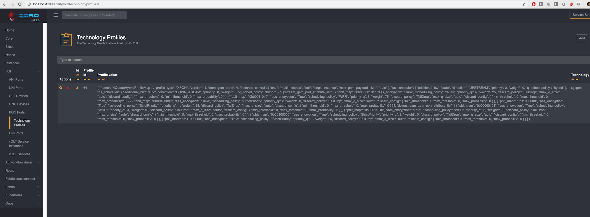

# Configuring a Technology Profile

SEBA 2.0 release onwards, configuring a Tech Profile is a necessary step before an OLT can be provisioned.

Tech profiles are loaded into VOLTHA's etcd cluster as simple json objects.
In a SEBA POD, like all other config, this **must** be done by configuring NEM as shown below in the 'profile_value'.

More information on Tech Profiles can be found [on the wiki](https://wiki.opencord.org/display/CORD/Technology+Profiles) or the [github readme](https://github.com/opencord/voltha/tree/master/common/tech_profile)


## Example 1 TCONT / 1 GEM port configuration

```yaml
tosca_definitions_version: tosca_simple_yaml_1_0
imports:
  - custom_types/oltdevice.yaml
  - custom_types/onudevice.yaml
  - custom_types/voltservice.yaml
  - custom_types/technologyprofile.yaml
description: Create a single TCONT single GEM tech profile for xgspon
topology_template:
  node_templates:

    service#volt:
      type: tosca.nodes.VOLTService
      properties:
        name: volt
        must-exist: true

    technologyProfile:
      type: tosca.nodes.TechnologyProfile
      properties:
        profile_id: 64
        technology: xgspon
        profile_value: >
          {
            "name": "4QueueHybridProfileMap1",
            "profile_type": "XPON",
            "version": 1.0,
            "num_gem_ports": 1,
            "instance_control": {
              "onu": "multi-instance",
              "uni": "single-instance",
              "max_gem_payload_size": "auto"
            },
            "us_scheduler": {
              "additional_bw": "auto",
              "direction": "UPSTREAM",
              "priority": 0,
              "weight": 0,
              "q_sched_policy": "hybrid"
            },
            "ds_scheduler": {
              "additional_bw": "auto",
              "direction": "DOWNSTREAM",
              "priority": 0,
              "weight": 0,
              "q_sched_policy": "hybrid"
            },
            "upstream_gem_port_attribute_list": [{
                "pbit_map": "0b11111111",
                "aes_encryption": "True",
                "scheduling_policy": "StrictPriority",
                "priority_q": 1,
                "weight": 0,
                "discard_policy": "TailDrop",
                "max_q_size": "auto",
                "discard_config": {
                  "min_threshold": 0,
                  "max_threshold": 0,
                  "max_probability": 0
                }
              }
            ],
            "downstream_gem_port_attribute_list": [{
                "pbit_map": "0b11111111",
                "aes_encryption": "True",
                "scheduling_policy": "StrictPriority",
                "priority_q": 1,
                "weight": 0,
                "discard_policy": "TailDrop",
                "max_q_size": "auto",
                "discard_config": {
                  "min_threshold": 0,
                  "max_threshold": 0,
                  "max_probability": 0
                }
              }
            ]
          }
```

## Example 1 TCONT / 4 GEM port configuration

```yaml
tosca_definitions_version: tosca_simple_yaml_1_0
imports:
  - custom_types/oltdevice.yaml
  - custom_types/onudevice.yaml
  - custom_types/voltservice.yaml
  - custom_types/technologyprofile.yaml
description: Creates a single TCONT four GEM tech profile
topology_template:
  node_templates:

    service#volt:
      type: tosca.nodes.VOLTService
      properties:
        name: volt
        must-exist: true

    technologyProfile:
      type: tosca.nodes.TechnologyProfile
      properties:
        profile_id: 64
        technology: xgspon
        profile_value: >
          {
            "name": "4QueueHybridProfileMap1",
            "profile_type": "XPON",
            "version": 1,
            "num_gem_ports": 4,
            "instance_control": {
              "onu": "multi-instance",
              "uni": "single-instance",
              "max_gem_payload_size": "auto"
            },
            "us_scheduler": {
              "additional_bw": "auto",
              "direction": "UPSTREAM",
              "priority": 0,
              "weight": 0,
              "q_sched_policy": "hybrid"
            },
            "ds_scheduler": {
              "additional_bw": "auto",
              "direction": "DOWNSTREAM",
              "priority": 0,
              "weight": 0,
              "q_sched_policy": "hybrid"
            },
            "upstream_gem_port_attribute_list": [
              {
                "pbit_map": "0b00000101",
                "aes_encryption": "True",
                "scheduling_policy": "WRR",
                "priority_q": 4,
                "weight": 25,
                "discard_policy": "TailDrop",
                "max_q_size": "auto",
                "discard_config": {
                  "max_threshold": 0,
                  "min_threshold": 0,
                  "max_probability": 0
                }
              },
              {
                "pbit_map": "0b00011010",
                "aes_encryption": "True",
                "scheduling_policy": "WRR",
                "priority_q": 3,
                "weight": 75,
                "discard_policy": "TailDrop",
                "max_q_size": "auto",
                "discard_config": {
                  "min_threshold": 0,
                  "max_threshold": 0,
                  "max_probability": 0
                }
              },
              {
                "pbit_map": "0b00100000",
                "aes_encryption": "True",
                "scheduling_policy": "StrictPriority",
                "priority_q": 2,
                "weight": 0,
                "discard_policy": "TailDrop",
                "max_q_size": "auto",
                "discard_config": {
                  "min_threshold": 0,
                  "max_threshold": 0,
                  "max_probability": 0
                }
              },
              {
                "pbit_map": "0b11000000",
                "aes_encryption": "True",
                "scheduling_policy": "StrictPriority",
                "priority_q": 1,
                "weight": 25,
                "discard_policy": "TailDrop",
                "max_q_size": "auto",
                "discard_config": {
                  "min_threshold": 0,
                  "max_threshold": 0,
                  "max_probability": 0
                }
              }
            ],
            "downstream_gem_port_attribute_list": [
              {
                "pbit_map": "0b00000101",
                "aes_encryption": "True",
                "scheduling_policy": "WRR",
                "priority_q": 4,
                "weight": 10,
                "discard_policy": "TailDrop",
                "max_q_size": "auto",
                "discard_config": {
                  "min_threshold": 0,
                  "max_threshold": 0,
                  "max_probability": 0
                }
              },
              {
                "pbit_map": "0b00011010",
                "aes_encryption": "True",
                "scheduling_policy": "WRR",
                "priority_q": 3,
                "weight": 90,
                "discard_policy": "TailDrop",
                "max_q_size": "auto",
                "discard_config": {
                  "min_threshold": 0,
                  "max_threshold": 0,
                  "max_probability": 0
                }
              },
              {
                "pbit_map": "0b00100000",
                "aes_encryption": "True",
                "scheduling_policy": "StrictPriority",
                "priority_q": 2,
                "weight": 0,
                "discard_policy": "TailDrop",
                "max_q_size": "auto",
                "discard_config": {
                  "min_threshold": 0,
                  "max_threshold": 0,
                  "max_probability": 0
                }
              },
              {
                "pbit_map": "0b11000000",
                "aes_encryption": "True",
                "scheduling_policy": "StrictPriority",
                "priority_q": 1,
                "weight": 25,
                "discard_policy": "TailDrop",
                "max_q_size": "auto",
                "discard_config": {
                  "min_threshold": 0,
                  "max_threshold": 0,
                  "max_probability": 0
                }
              }
            ]
          }
```

For instructions on how to push TOSCA into a CORD POD, please
refer to this [guide](../../../xos-tosca/README.md).

## Verify Tech Profile in NEM database

On the NEM GUI, confirm that the tech profile is added. Note that this view does not currently pretty-print the json.




## Verify Tech Profile in Etcd

We can verify that the tech profile has been downloaded by NEM into the Etcd cluster. For that we first need to enter the etcd container using kubectl.

```shell
~$ kubectl exec -it $(kubectl get pods | grep etcd-cluster | awk 'NR==1{print $1}') /bin/sh
```

Once inside, we can use the etcdctl tool to fetch the stored information for the profile using the profile type and id.

```shell
/ # ETCDCTL_API=3 etcdctl get --prefix  service/voltha/technology_profiles/xgspon/64
```
If all is well, the above command should display the same tech profile information you configured.
In a running system where the OLT has also been configured, and ONUs have been discovered and ranged, you should also see *instances* of the tech-profile in the display above for each ONU. These instances specify the particular GEM port ids and related Alloc ids used for the ONU.
