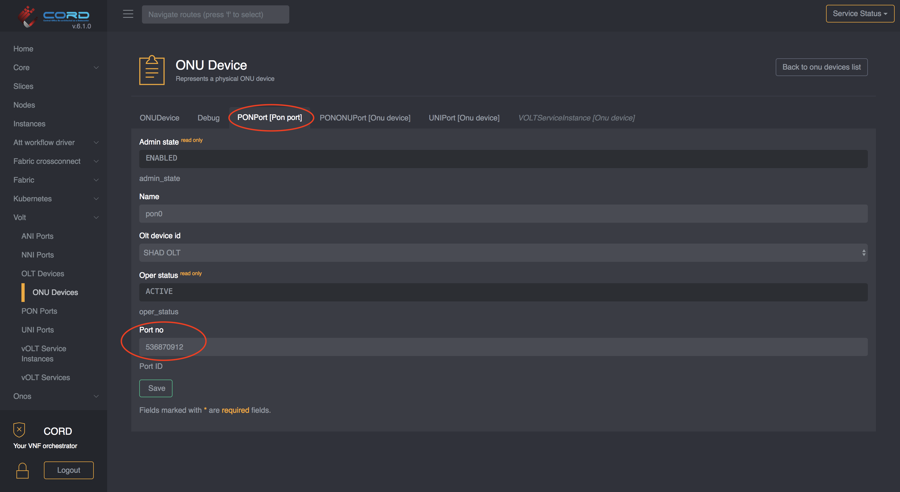

# Configure AT&T Workflow

We assume your POD is already configured as per [this instructions](../configuration.md)
(you need to complete only the first section)

## Whitelist population

> NOTE: the whitelist can be populated at any time.
> It doesn't need to be done upfront.

To configure the ONU whitelist, you can use this TOSCA:

```yaml
tosca_definitions_version: tosca_simple_yaml_1_0
imports:
  - custom_types/attworkflowdriverwhitelistentry.yaml
  - custom_types/attworkflowdriverservice.yaml
description: Create an entry in the whitelist
topology_template:
  node_templates:

    service#att:
      type: tosca.nodes.AttWorkflowDriverService
      properties:
        name: att-workflow-driver
        must-exist: true

    whitelist:
      type: tosca.nodes.AttWorkflowDriverWhiteListEntry
      properties:
        serial_number: BRCM22222222
        pon_port_id: 536870912
        device_id: of:000000000a5a0072
      requirements:
        - owner:
            node: service#att
            relationship: tosca.relationships.BelongsToOne
```

For instructions on how to push TOSCA into a CORD POD, please
refer to this [guide](../../../xos-tosca/README.md).

### Where to find the required information

#### Serial Number

To locate the ONU serial number you can open the ONU detail view (`vOLT -> ONU Devices`).


> NOTE: most of the time the serial number is also printed on the physical device.

#### Pon Port ID

The `pon_port_id` can be found from the ONU detail view, by selecting the `PON Port`
tab:



#### Device ID

The `device_id` can easily be found in the OLT list view. Note the `device_id` is
the openflow ID of the logical device exposed to ONOS, and not the serial number
of the device.


## Device monitoring

Please refer to the [monitoring](../../../charts/logging-monitoring.md) chart.
